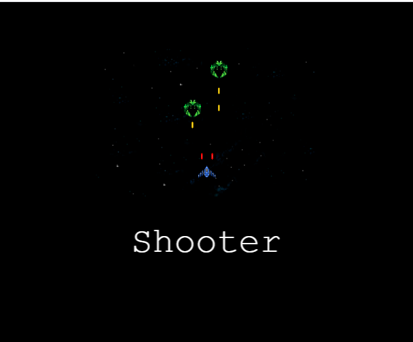
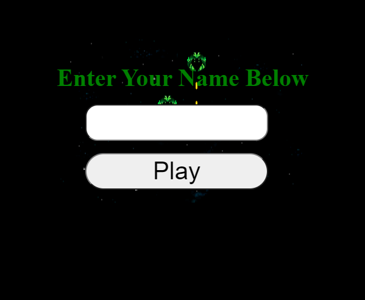
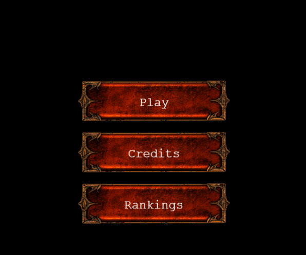
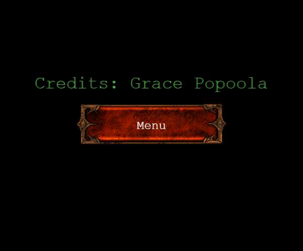
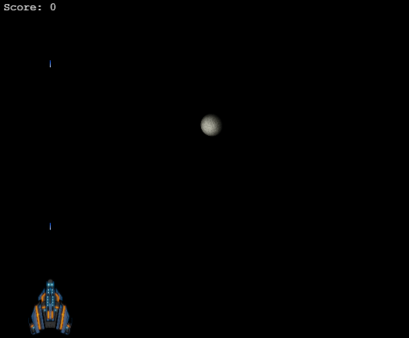
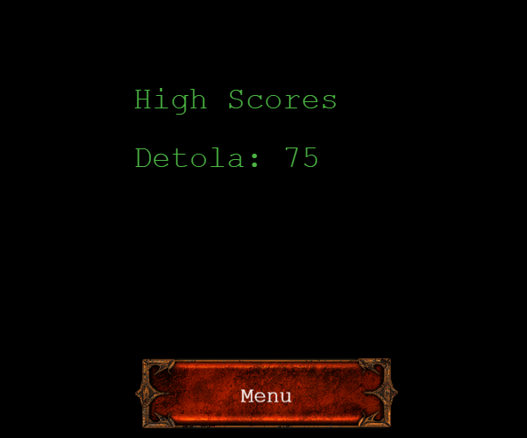

# JavaScript capstone project - Shooter game

Building a turn-based shooter game using JavaScript and Phaser game engine

## GAME DESIGN DOCUMENTATION

#### Game Design

1. The initial step in designing the is to create a map. A world in which game will occur.
2. To create the scene with a dark background.
3. The game objects are nothing but simple images.
4. After the world, the biggest challenge in the game is to create a player that belongs to the map.
5. The player has to survive the enemies while trying to eliminate as many as they can.
6. While trying to eliminate obstacles, the player will also have to avoid contact with them.
7. Collision with the obstacles resulting in a game over.

#### Game play

The game currently contains one level, the velocity of the player and enemies is designed to become faster as the player earns a higher score. The player will fail if they collide with enemy spaceships. The main challenge in the game is coming in contact with enemies, which means automatic death for the player.

#### Assets choice

Choice of assets for the game was obtained from opengameart.org, this includes player, enemy, background.

### Objective

The objective of this project is to build a simple shooter game with a scoring system, using JavaScript ES6, Phaser 3 framework, and other modern technologies.

# User Interface

The User Interface is designed to deliver a very smooth experience. There are four main scenes for User Interface.

- The Boot Scene

  It shows a bar while the game is loading assets

    <p align="center">
  
  </p>

    <p align="center">
  
  </p>

- The title Scene

It shows the title of the game with three different option; viz, Play, Credits, and Ranking.

  <p align="center">
  
  </p>

- Credits Scene

  <p align="center">
  
  </p>

- Game Scene

Contains the UI necessary to play the game.

   <p align="center">
  
  </p>

- Ranking Scene

The name of the user and score appears here

  <p align="center">
  
  </p>

## Live Demo

[Click here](https://adoring-hawking-1d392d.netlify.app) to visit the live demo of the application.

## Technologies used

- HTML5/CSS
- Phaser 3
- Webpack
- Javascript
- Eslint
- Babel
- Jest for testing
- [Netlify](https://www.netlify.com/) for deployment
- [Leaderboard API service](https://www.notion.so/Leaderboard-API-service-24c0c3c116974ac49488d4eb0267ade3) for high scores

#### Get a local copy

_npm required_ - [get npm](https://www.npmjs.com/get-npm)

### Installation

You can always use the [live version](https://guns-of-boom.netlify.app/) to play right away or install it locally using these steps:

**Clone the repository by running this command in your terminal**

```
git clone
```

**Navigate into the newly created folder**

```
cd Shooter-game
```

#### Get the dependencies needed for the game

`$ npm install`

#### Start the server

`$ npm start`

**Visit this link to see the game in your browser**

```
http://localhost:8080/
```

**Run Jest tests**

```
npm run test
```

## Acknowledgements

- Microverse
- Opengameart.org
- Button Image by StumpyStrust

## Author

👤 **Popoola Grace Boluwatife**

- Github: [@GraceOyiza](https://github.com/GraceOyiza)
- Twitter: [@\_PopsonGrace](https://twitter.com/_PopsonGrace)
- LinkedIn: [@grace](https://www.linkedin.com/in/grace-popoola)

## 🤝 Contributing

Contributions, issues and feature requests are welcome!

Feel free to check the [issues page](https://github.com/GraceOyiza/Todo_app/issues).

## Show your support

Give a ⭐️ if you enjoyed this project!

## 📝 License

This project is [MIT](lic.url) licensed.
